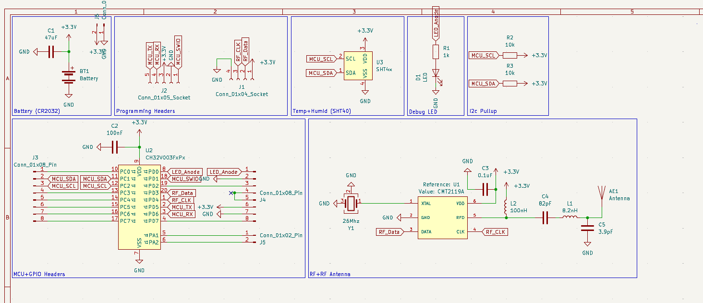
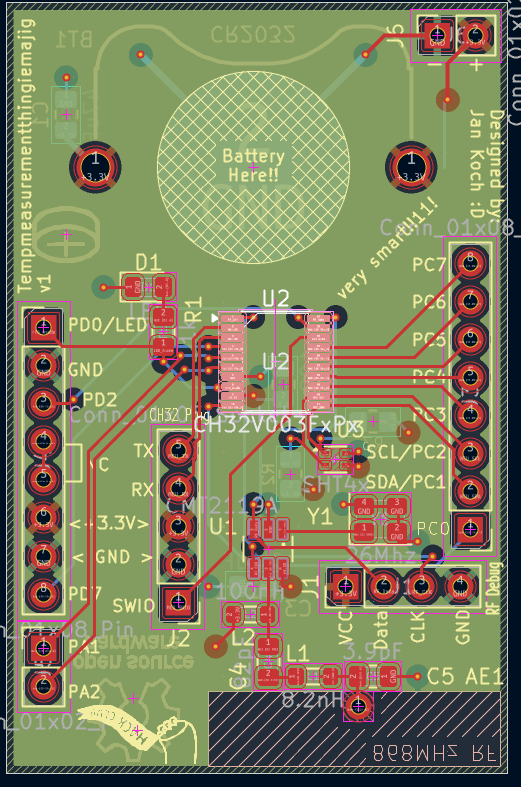
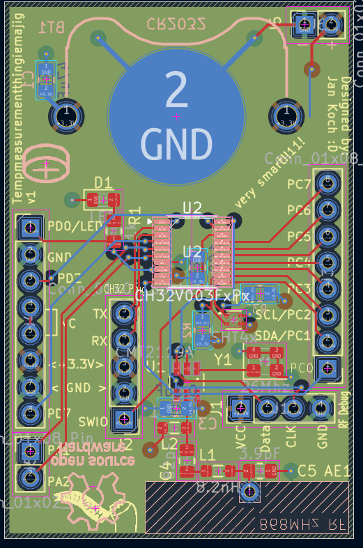

# Temperaturemeasurementthingimajig

That was a mouthful!

This is one of my first fully designed and hopefully made pcbs! :D

basically this is a small sensor node based on the readily availible CH32V003 which is a low cost (~20 cents!) risc-v MCU. it features a feature rich IO (well for 0.2usd it is). I am using the SHT4x chip to actually capture the environmental readings, because it is both accurate and fairly cost effective.

## Why should you care?

Honestly... You probably shouldnt, but for those who do want to know why: the whole node is open source meaning it can be re-mixed, re-branded and changed to your hearts content maybe even slap your logo or a silly cat on the silkscreen, it is also very cheap. running off a cr2032 and only costing about 3usd per node! Now compare that to the shelly series of Humid+Temp nodes...

## How is it so cheap??

I got it down to a nice value because i didnt use a expensive MCU like the ESP32 series (even though they are pretty effective in cost if you want wifi) but instead a cheaper and more bare bones MCU, since my project just didnt need it! a simple ASK/OOK transmitter instead of a costly variable or even wifi chip brought it down a lot as well. (we're talking cents but who cares)

## Bill of materials! (yall gotta foot the bill on this one :P /satire)
| Quantity | Component / Description | Package / Size | Estimated Cost (USD)
| :---: | :--- | :--- | :--- |
| **1x** | CR2032 Coin Cell Battery Holder | Through-Hole | 0.13 |
| **1x** | WCH CH32V003F4P6 Microcontroller | TSSOP-20 | 0.28 |
| **1x** | CMT2119A RF Transmitter | SOT-23-6 | 0.58 |
| **1x** | SHT4x Temperature & Humidity Sensor | DFN-4 | 0.95 |
| **1x** | 26MHz Crystal | SMD 3225 | 0.07 |
| **1x** | 868MHz Spring Antenna | Helical Spring | 0.23 |
| **1x** | Any color LED | 0805 | 0.02 |
| **2x** | 10k Ohm Resistor | 0805 | 0.004 |
| **1x** | 1k Ohm Resistor | 0805 | 0.004 |
| **1x** | 8.2nH Inductor | 0805 | 0.04 |
| **1x** | 100nH Inductor | 0805 | 0.04 |
| **1x** | 47uF Capacitor | 0805 | 0.22 |
| **2x** | 100nF (0.1uF) Capacitor | 0805 | 0.034 |
| **1x** | 82pF Capacitor | 0805 | 0.018 |
| **1x** | 3.9pF Capacitor | 0805 | 0.015 |

## AI...

I want to be as transparent as i can. I did use AI to help me scout components like the SHT40 instead of the AHT20 i was familiar with. i also used it for my rf, it called out my shitty meander (which i calculated as a microstrip, oops) which i then replaced with a more easier to work with coil antenna.
However i do not feel as if i used ai to a higher degree than 20% since i still did all of the design work, i wired up the schematic, i read the datasheets and i eventually designed the pcb.

## What programs were used
 - KiCad
 - Onshape

## Images :D

## Hackclub? 

This is a submission to hackclub's forge! Hackclub is a cool charity yall should go check them out!

## Contact me or sum

Email: jan.koch@hexagonical.ch

orrr:

@meepstertron on the hackclub slack!